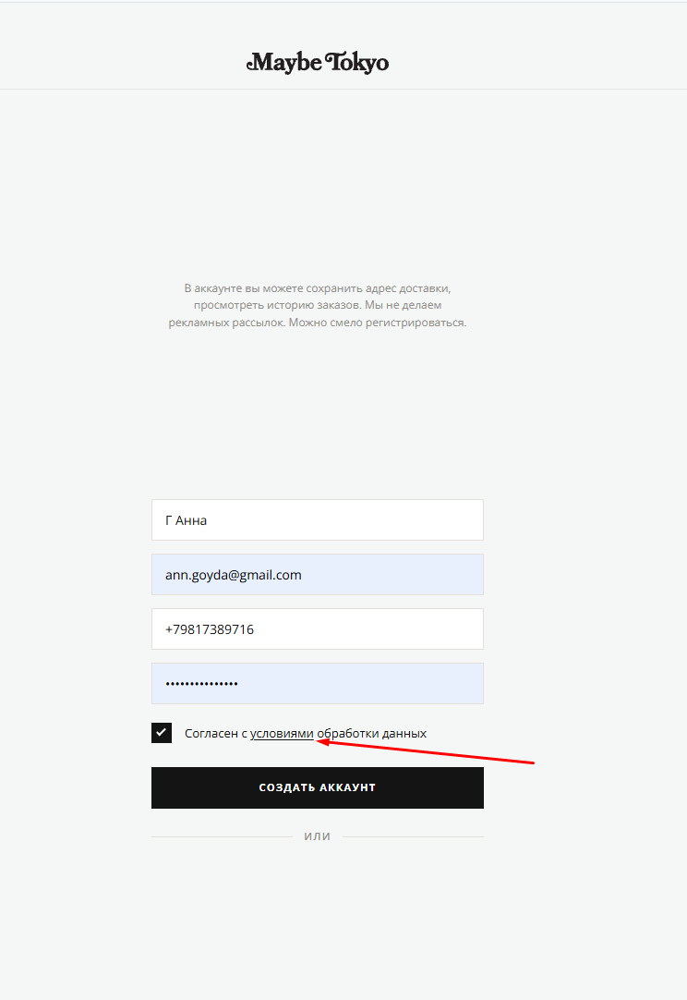

# Bug 001: некорректная ссылка "Условия обработки данных"

## Статус
`Open`

## Приоритет
`Critical`

## Окружение
- Платформа/ОС: Windows 10
- Браузер (если применимо): Google Chrome

## Описание
Ссылка "Условия обработки данных" с которыми необходимо согласиться пользователю при регистрации аккаунта никуда не ведет

## Шаги для воспроизведения
1. Зайти на сайт.
2. Начать регистрацию нового пользователя.
3. Кликнуть на гиперссылку "Условия обработки данных" напротив галки над кнопкой "Создать аккаунт".

## Фактический результат
Ссылка ведет на страницу каталога.

## Ожидаемый результат
Ссылка ведет на условия обработки данных - https://maybetokyo.com/privacy.

## Скриншоты/логи

