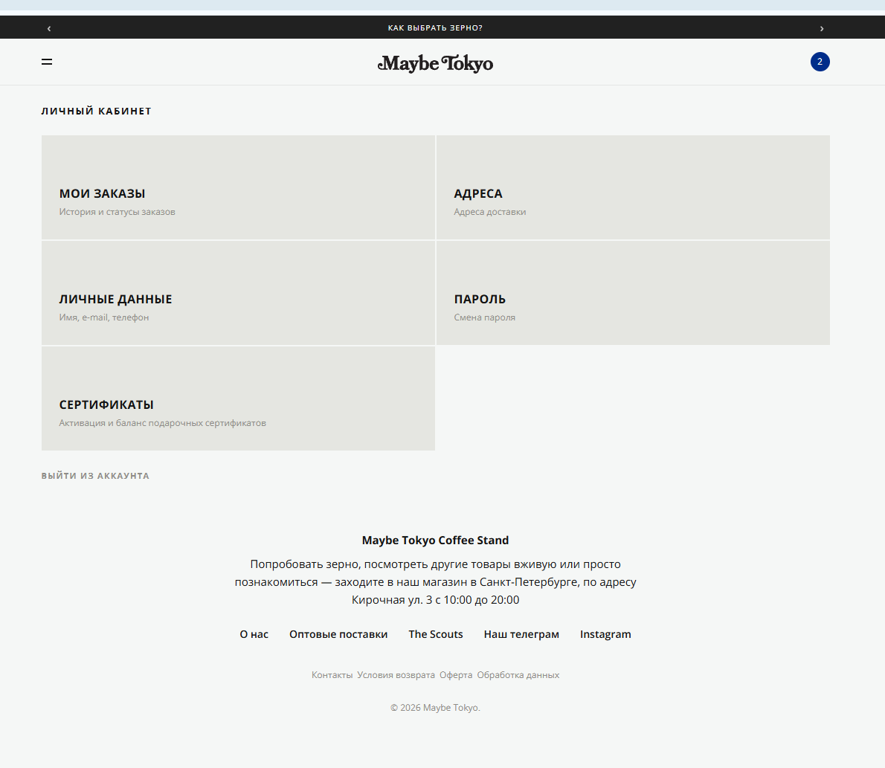

# Bug 002: отсутствует возможность удалить аккаунт 

## Статус
`Open`

## Приоритет
`Critical`

## Окружение
- Платформа/ОС: Windows 10
- Браузер (если применимо): Google Chrome

## Описание
Отсутствие кнопки "Удалить аккаунт" - это нарушение Федерального закона № 152-ФЗ «О персональных данных». С точки зрения веб-стандартов, дизайна и прав потребителей, сокрытие кнопки удаления аккаунта называется «темным паттерном» (Dark Patterns) или «Ловушка для тараканов» (Roach Motel).

## Шаги для воспроизведения
1. Зайти на сайт и авторизоваться.
2. Перейти в аккаунт.

## Фактический результат
Отсутствует кнопка "Удалить аккаунт" в Личном кабинете.

## Ожидаемый результат
Наличие рабочей кнопки "Удалить аккаунт" в личном кабинете.

## Скриншоты/логи

