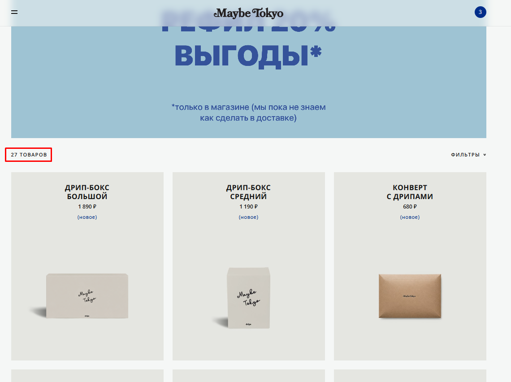
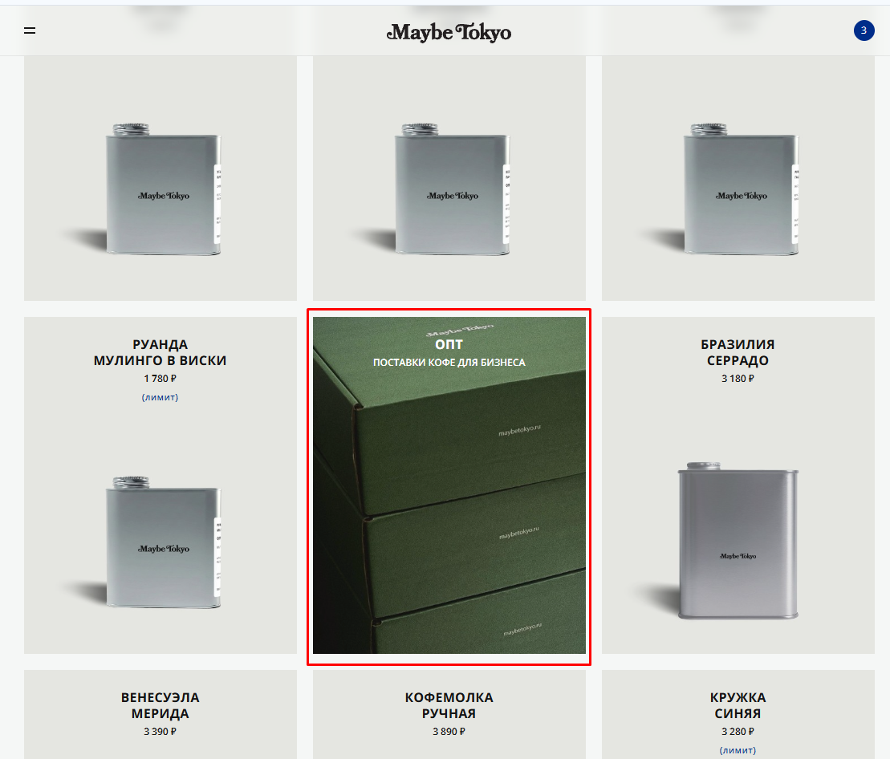

# Bug 003: некорректное количество товаров в Product counter 

## Статус
`Open`

## Приоритет
`Major`

## Окружение
- Платформа/ОС: Windows 10
- Браузер (если применимо): Google Chrome

## Описание
Счетчик товаров (Product counter) отображает некорректное количество товаров - 27 товаров. При этом, в каталоге есть 1 услуга, а реальных товаров 26.

## Шаги для воспроизведения
1. Зайти на сайт.
2. Открыть каталог.

## Фактический результат
Product counter указывает 27 товаров, хотя одна из карточек - это услуга и ее нельзя добавить в корзину.

## Ожидаемый результат
Product counter указывает 26 товаров, а услуга идет в доп.разделе.

## Скриншоты/логи

