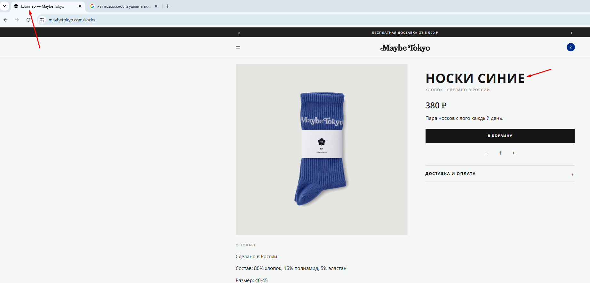

# Bug 004: неcоответствие названия товара с названием вкладки 

## Статус
`Open`

## Приоритет
`Major`

## Окружение
- Платформа/ОС: Windows 10
- Браузер (если применимо): Google Chrome

## Описание
Название вкладки не совпадает с названием товара. 

## Шаги для воспроизведения
1. Зайти на сайт.
2. Открыть каталог.
3. Выбрать товар "Носки синие".
4. Посмотреть на название вкладки.

## Фактический результат
Название вкладки "Шоппер" не совпадает с названием товара "Носки синие".

## Ожидаемый результат
Название вкладки совпадает с названием товара "Носки синие".

## Скриншоты/логи

