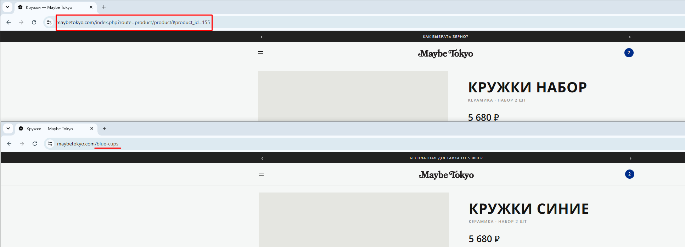

# Bug 005: у некоторых товаров не прописан ЧПУ (человекопонятный URL)

## Статус
`Open`

## Приоритет
`Major`

## Окружение
- Платформа/ОС: Windows 10
- Браузер (если применимо): Google Chrome

## Описание
У нескольких товаров не прописан СЕО URL - это влияет на СЕО при поиске.

## Шаги для воспроизведения
1. Зайти на сайт.
2. Открыть каталог.
3. Открыть товары: "Кружка" (https://maybetokyo.com/index.php?route=product/product&product_id=154), "Кения Мугайя" (https://maybetokyo.com/index.php?route=product/product&product_id=143), "Кружки набор" (https://maybetokyo.com/index.php?route=product/product&product_id=155)

## Фактический результат
У данных товаров в адресной строке не человекопонятный URL: https://maybetokyo.com/index.php?route=product/product&product_id=154, https://maybetokyo.com/index.php?route=product/product&product_id=143, https://maybetokyo.com/index.php?route=product/product&product_id=155 соотвественно.

## Ожидаемый результат
У данных товаров прописан правильный СЕО URL по аналогии с другими товарами: https://maybetokyo.com/white-cup, https://maybetokyo.com/keniya-mugayya-200g, https://maybetokyo.com/white-cups соответственно.

## Скриншоты/логи

