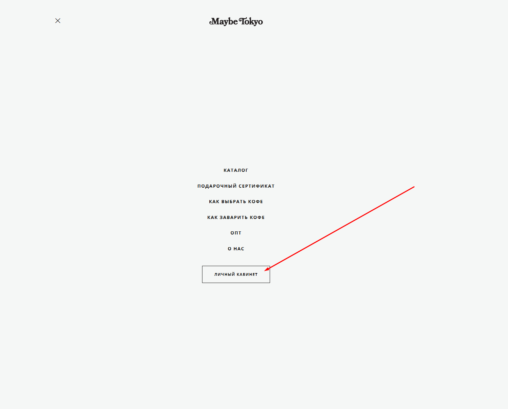
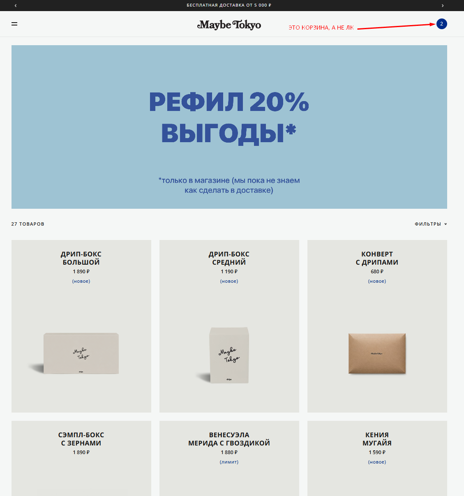

# Bug 006: кнопка "Личный кабинет" расположена только в бургер-меню

## Статус
`Open`

## Приоритет
`Major`

## Окружение
- Платформа/ОС: Windows 10
- Браузер (если применимо): Google Chrome

## Описание
Кнопка "Личный кабинет" вынесена не в шапку (хедер) для быстрого доступа, а спрятана внутри бургер-меню.

## Шаги для воспроизведения
1. Зайти на сайт.
2. Открыть бургер-меню.

## Фактический результат
Кнопка "Личный кабинет" спрятана внутри бургер-меню.

## Ожидаемый результат
Кнопка "Личный кабинет" вынесена в хедер для быстрого доступа.

## Скриншоты/логи

