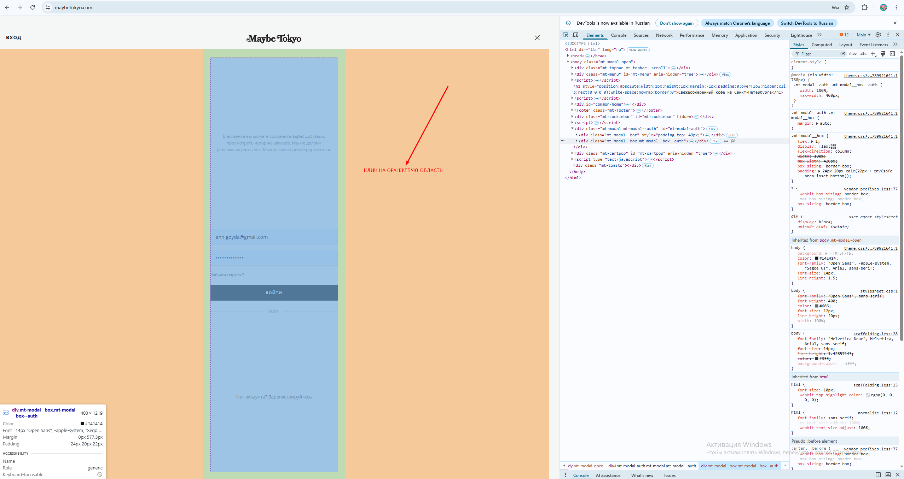

# Bug 007: отсутствует затемняющая подложка (overlay) у модального окна авторизации пользователя

## Статус
`Open`

## Приоритет
`Major`

## Окружение
- Платформа/ОС: Windows 10
- Браузер (если применимо): Google Chrome

## Описание
Отсутствует затемняющая подложка (overlay) у модального окна авторизации, из-за чего возможен случайный клик по заднему плану и переадресация на главную страницу.

## Шаги для воспроизведения
1. Зайти на сайт.
2. Открыть меню.
3. Нажать кнопку "Войти".
4. Кликнуть по пустой области сбоку.

## Фактический результат
Подложка у модального окна не затемнена из-за чего края окна не видно.

## Ожидаемый результат
Видна зтемняющая подложка модального окна (оверлей), благодаря чему виден край модального окна.

## Скриншоты/логи

