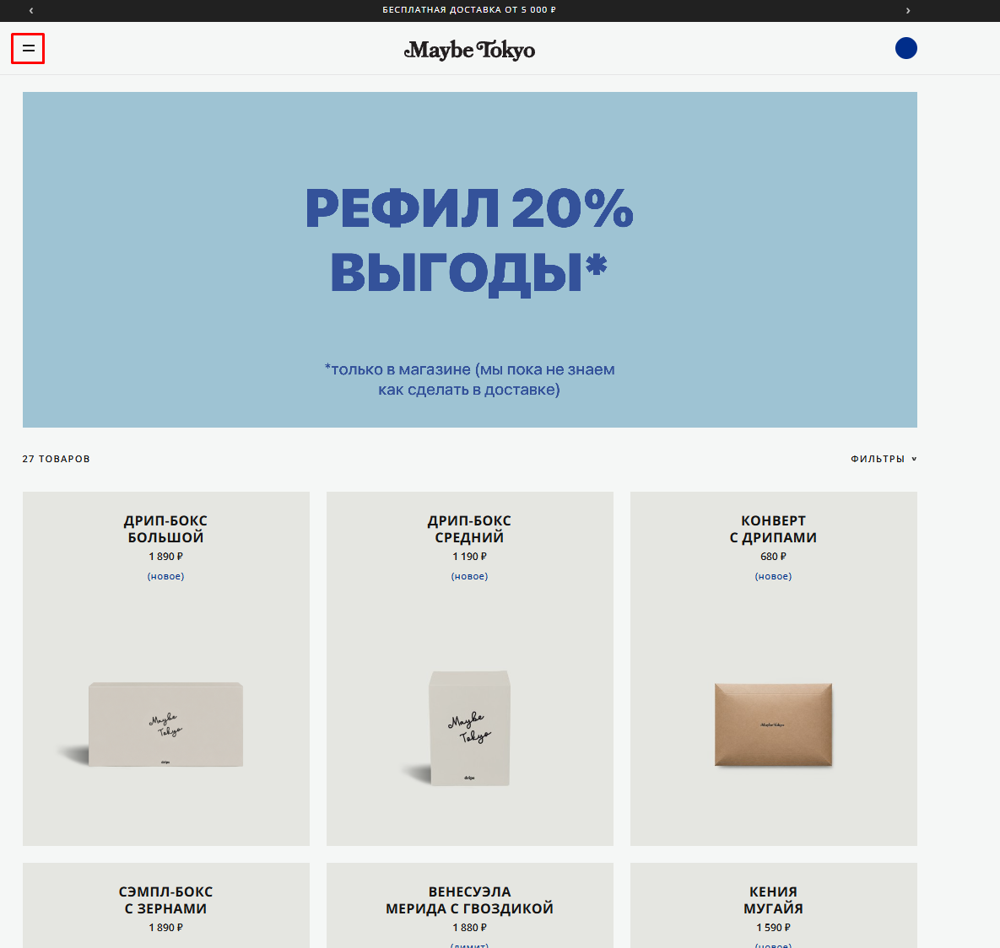

# Bug 008: непонятная иконка бургер-меню

## Статус
`Open`

## Приоритет
`Major`

## Окружение
- Платформа/ОС: Windows 10
- Браузер (если применимо): Google Chrome

## Описание
Иконка бургер-меню некорректна, т.к. общепринятый символ в веб-дизайне - это иконка из 3 параллельных линий, а на сайте - из 2х.

## Шаги для воспроизведения
1. Зайти на сайт.
2. Открыть каталог.

## Фактический результат
Иконка меню - символ из двух параллельных линий.

## Ожидаемый результат
Иконка меню - символ из трех параллельных линий.

## Скриншоты/логи

