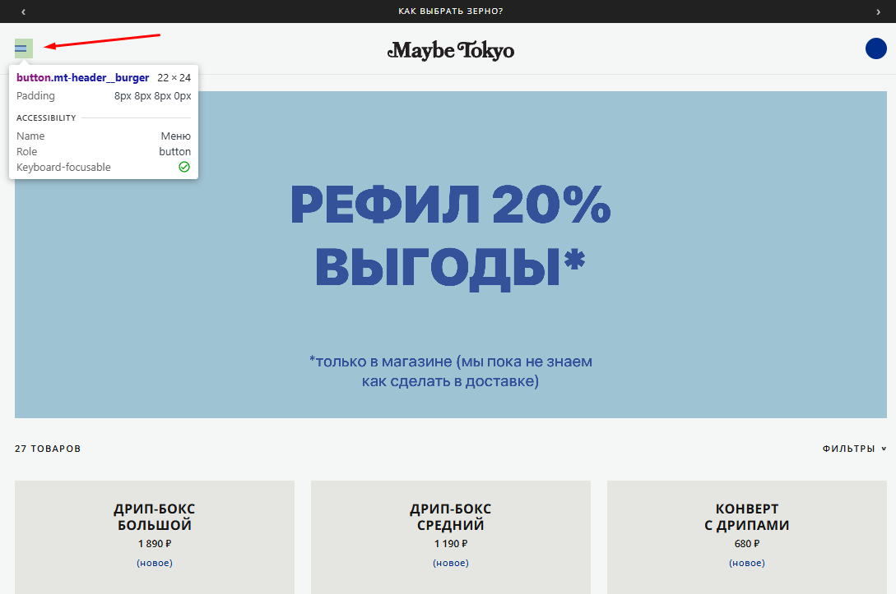
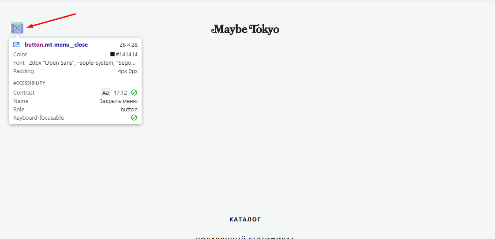

# Bug 009: несовпадение координат кнопок открытия и закрытия бургер-меню

## Статус
`Open`

## Приоритет
`Medium`

## Окружение
- Платформа/ОС: Windows 10
- Браузер (если применимо): Google Chrome

## Описание
Несовпадение координат кнопок открытия ("бургер") и закрытия ("крестик") ломает паттерн поведения пользователя. Из-за этого пользователю приходится заново целиться, чтобы закрыть меню.

## Шаги для воспроизведения
1. Зайти на сайт.
2. Открыть меню.
3. Закрыть меню.

## Фактический результат
Иконка закрытия («крестик») смещается по осям X/Y по сравнению с иконкой «бургера». 

## Ожидаемый результат
Иконка «крестик» идеально накладываться на координаты иконки «бургер» (в одной и той же bounding box / области клика), чтобы пользователь мог открыть и закрыть меню кликом в одну и ту же точку экрана.

## Скриншоты/логи

