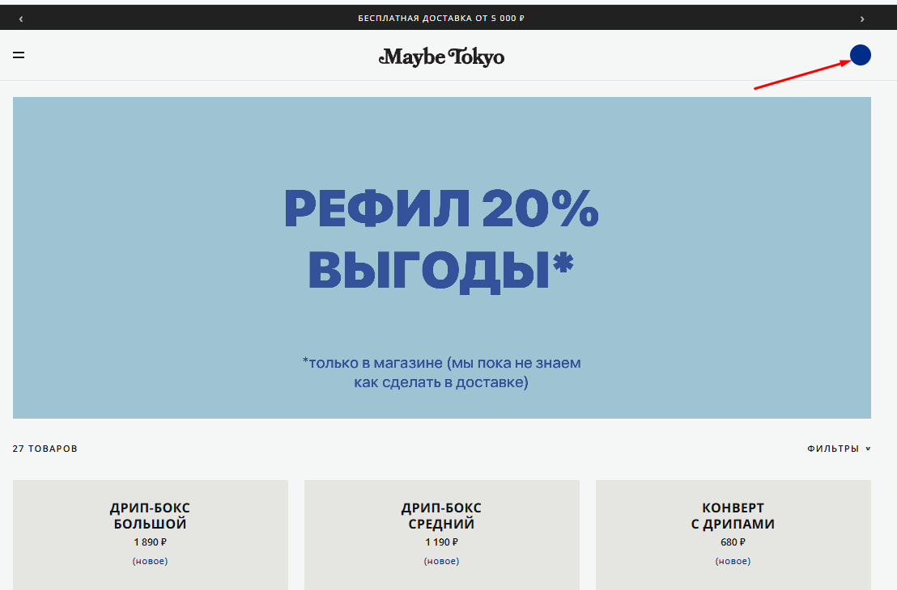

# Bug 010: отсутствует иконка корзины

## Статус
`Open`

## Приоритет
`High`

## Окружение
- Платформа/ОС: Windows 10
- Браузер (если применимо): Google Chrome

## Описание
В хедере отсутствует иконка корзины; вместо иконки в правом углу есть "бейдж" в виде синего круга, отображающий количество товаров в корзине после их добавления.

## Шаги для воспроизведения
1. Зайти на сайт.
2. Попытаться найти корзину.

## Фактический результат
В хедере в правом верхне углу расположен бейдж (синий круг).

## Ожидаемый результат
Иконка корзины должна отображаться в шапке всегда.
Синий круг (бейдж) должен показываться лишь для отображения количества добавленных товаров.

## Скриншоты/логи

