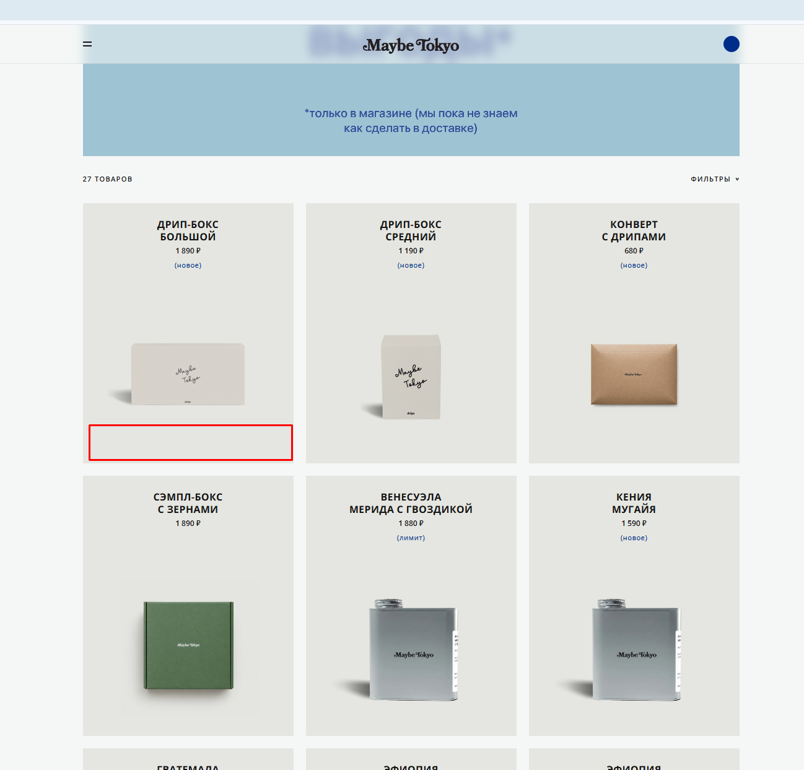

# Bug 011: отсутствие возможности добавления товара в корзину напрямую из каталога

## Статус
`Open`

## Приоритет
`Major`

## Окружение
- Платформа/ОС: Windows 10
- Браузер (если применимо): Google Chrome

## Описание
Товар нельзя добавить из каталога (например, через плюсик) в корзину, необходимо заходить в карточку и добавлять товар оттуда, а потом возвращаться в каталог и искать другие необходимые товары.

## Шаги для воспроизведения
1. Зайти на сайт.
2. Открыть каталог.
3. Попытаться быстро добавить товар в корзину.

## Фактический результат
На плитках товаров в каталоге полностью отсутствуют интерактивные элементы для быстрой покупки.

## Ожидаемый результат
На каждой плитке товара в каталоге предусмотрена кнопка быстрого добавления в корзину (например "+" или "купить").

## Скриншоты/логи

