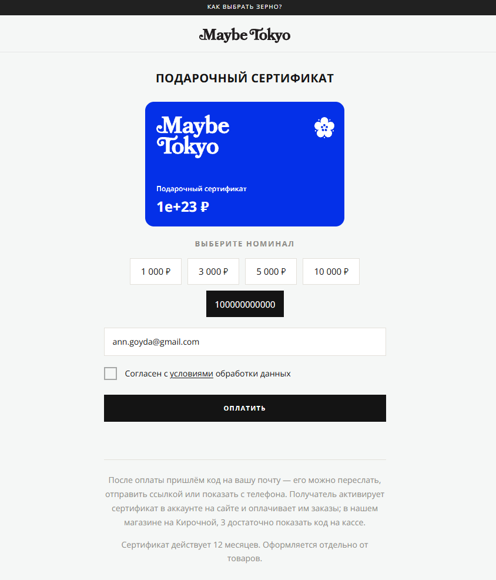
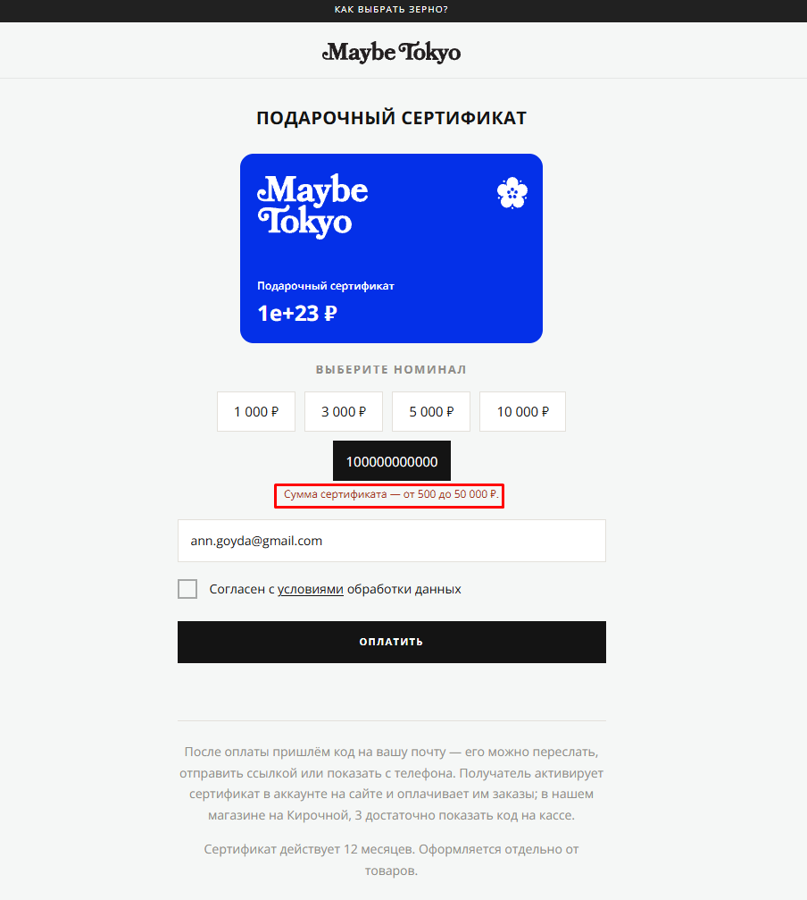

# Bug 012: отсутствие валидации на стороне клиента (UI) для лимита суммы подарочного сертификата.

## Статус
`Open`

## Приоритет
`Major`

## Окружение
- Платформа/ОС: Windows 10
- Браузер (если применимо): Google Chrome

## Описание
Нет ограничения на максимальную сумму подарочного сертификата на стороне клиента (на коде все ок).
Это вводит в заблуждение. Необходимо предотвращать ошибки, а не констатировать их в конце (это правило хорошего дизайна интерфейса).

## Шаги для воспроизведения
1. Зайти на сайт.
2. Нажать на иконку меню в левом верхнем меню.
3. Кликнуть в открывшемся меню на "Подарочный сертификат".
4. На открывшейся странице кликнуть на "Номинал" и ввести "100000000000000000000000".
5. Нажать кнопку "Оплатить".

## Фактический результат
Валидация суммы происходит после того, как клиент ввел некорректную сумму и нажал оплатить.
На графическом макете сертификата сумма остается некорректной.

## Ожидаемый результат
Валидация суммы происходит мгновенно (inline).
На графическом макете сертификата сумма не превышает максимально допустимый лимит.
Кнопка «Оплата» блокируется (становится неактивной), если введенная сумма некорректна.

## Скриншоты/логи

