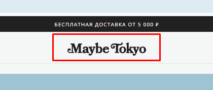
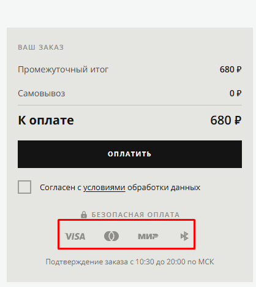

# Bug 013: низкое разрешение и пикселизация картинок на сайте

## Статус
`Open`

## Приоритет
`Major`

## Окружение
- Платформа/ОС: Windows 10
- Браузер (если применимо): Google Chrome

## Описание
Плохое качество картинок на сайте: иконки оплаты (visa, mc и т.д.), логотип. Снижает доверие пользователей к интернет-магазину.

## Шаги для воспроизведения
1. Зайти на сайт.
2. Авторизоваться.
3. Добавить любой товар в корзину и перейти в нее.
5. Нажать кнопку "Оплатить".
6. Посмотреть на иконки платежных карт.
7. Посмотреть на логотип сайта.

## Фактический результат
Пиксельные иконки оплаты и логотипа сайта.

## Ожидаемый результат
Высокое разрешение картинок. Картинки в формате .svg и для них установлено правильное разрешение, соответствующее контейнеру, в котором они отображаются.

## Скриншоты/логи

