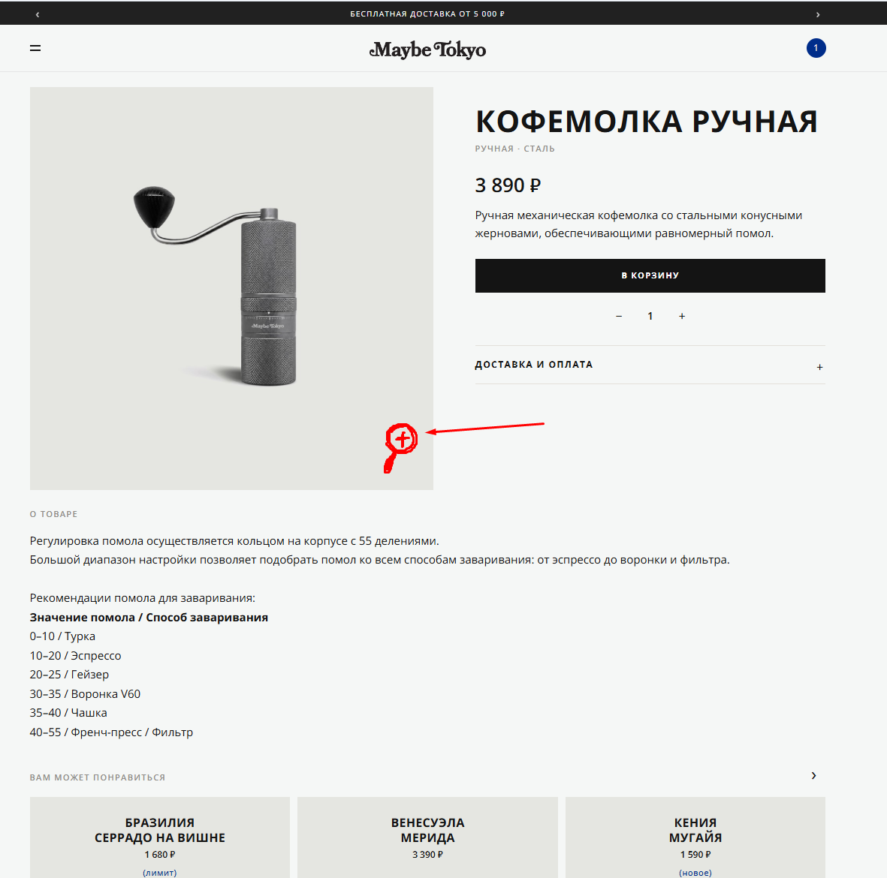

# Bug 014: отсутствует функционал зума изображений товара

## Статус
`Open`

## Приоритет
`Major`

## Окружение
- Платформа/ОС: Windows 10
- Браузер (если применимо): Google Chrome

## Описание
Нет возможности приблизить изображение, в особенности, это касается мерча и посуды. Это может привести к вовратам товаров.

## Шаги для воспроизведения
1. Зайти на сайт и авторизоваться.
3. Открыть каталог.
4. Открыть товар из каталога.
5. Убедиться, что функции увеличения нет.

## Фактический результат
Нет функционала увеличения изображения в карточке товара.

## Ожидаемый результат
Иконка "лупа" для увеличения изображения в карточке товара, позволяющая рассмотреть картинку ближе.

## Скриншоты/логи

