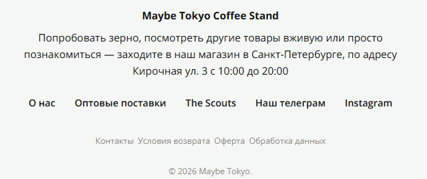
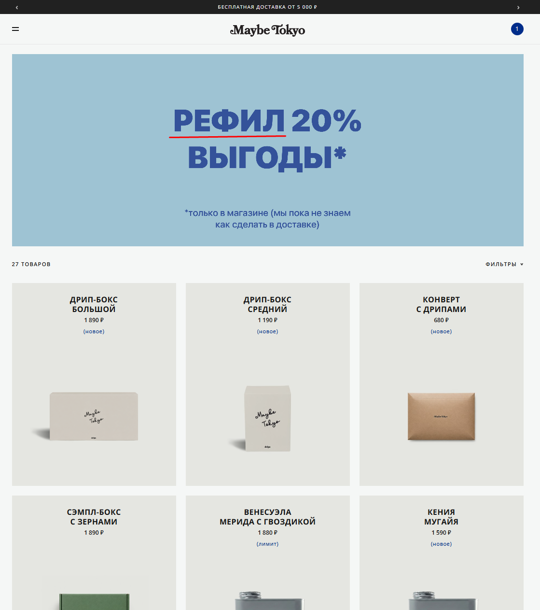
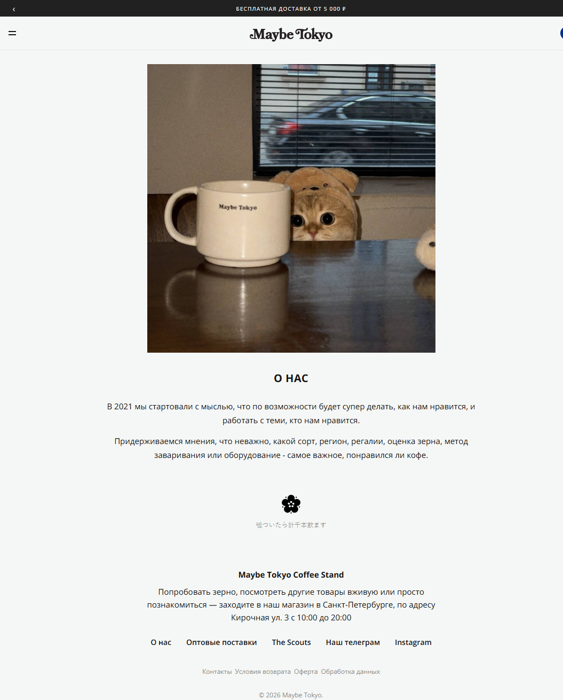

# Bug 016: некорректно построенные преложения и неполнота данных в текстах на сайте

## Статус
`Open`

## Приоритет
`Major`

## Окружение
- Платформа/ОС: Windows 10
- Браузер (если применимо): Google Chrome

## Описание
Некорректно написанные тексты, неполные с неграмотно построенные, подрывают авторитет сайта у пользователей.

## Шаги для воспроизведения
1. Зайти на сайт.
3. Посмотреть текст информационного блока в подвале сайта.
4. Открыть каталог товаров и посмотреть на текст про рефил на баннере.
5. Открыть раздел "О нас" в меню и посмотреть текст.

## Фактический результат
- В информационном блоке странно построен текст `"...заходите в наш магазин в Санкт-Петербурге, по адресу Кирочная ул. 3..."`.
- Нет определения слову "Рефил" (он больше нигде не встречается в каталоге).
- В разделе "О нас" нет полного и четкого понимания о том, что это за интернет-магазин и кафе на сайте котрого находится пользователь.

## Ожидаемый результат
- В информационном блоке текст может быть построен так: `"...заходите в наш магазин, по адресу: г.Санкт-Петербург, ул.Кирочная, д. 3"`.
- Слову "Рефил" на баннере со скидкой дано определение.
- В разделе "О нас" емкое и понятное описание компании и ее деятельности.

## Скриншоты/логи

