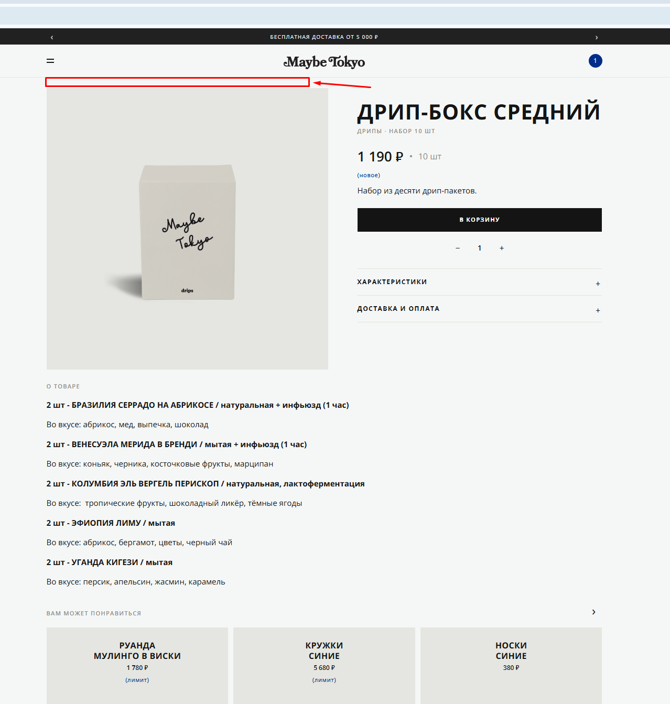

# Bug 017: отсутствие навигационной цепочки и возможности возврата на предыдущую страницу

## Статус
`Open`

## Приоритет
`Major`

## Окружение
- Платформа/ОС: Windows 10
- Браузер (если применимо): Google Chrome

## Описание
Отсутствие „хлебных крошек“. Нет возможности вернуться на предыдущую страницу (Dead-end page).

## Шаги для воспроизведения
1. Зайти на сайт.
3. Открыть каталог.
4. Открыть любой товар.
5. Убедиться, что сверху над картинкой товара нет "хлебных" крошек.
6. Убедиться, что нет функционала в карточке, чтобы вернуться назад в каталог.

## Фактический результат
Отсутствие функционала вернуться назад к каталогу. Отсутствие навигационной цепочки сверху над изображением товара.

## Ожидаемый результат
Есть кнопка "К каталогу" в карточке товара. Сверху над изображением товара расположена навигационная цепочка ("хлебные крошки"), чтобы пользователь понимал, где он находится на сайте магазина.

## Скриншоты/логи

