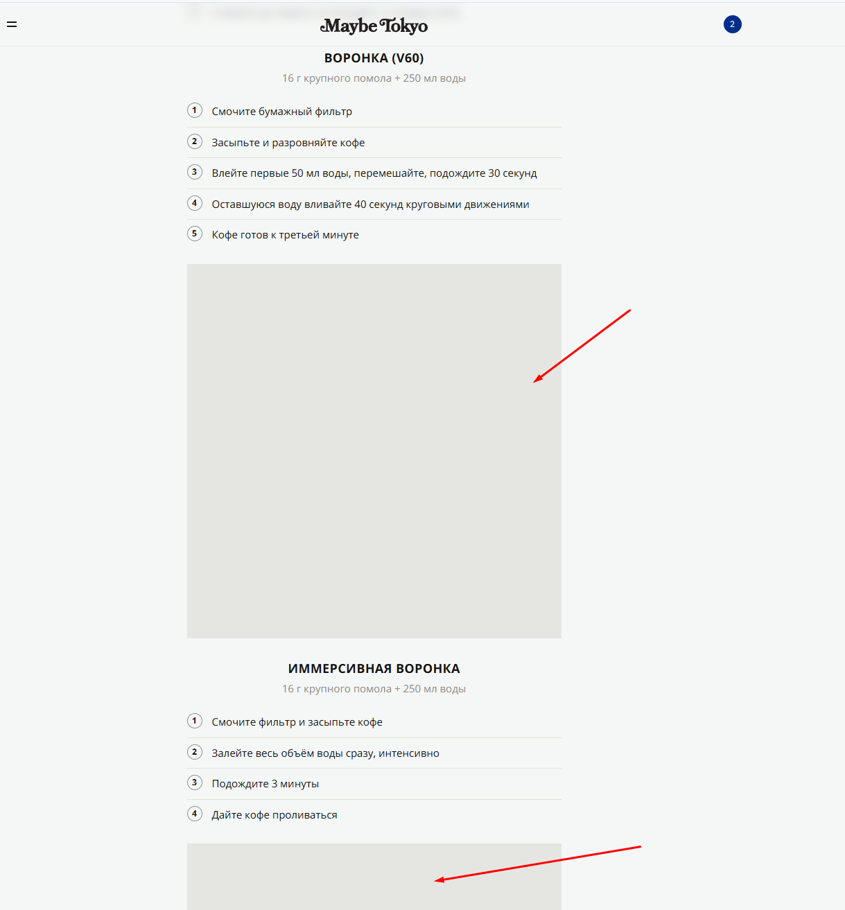
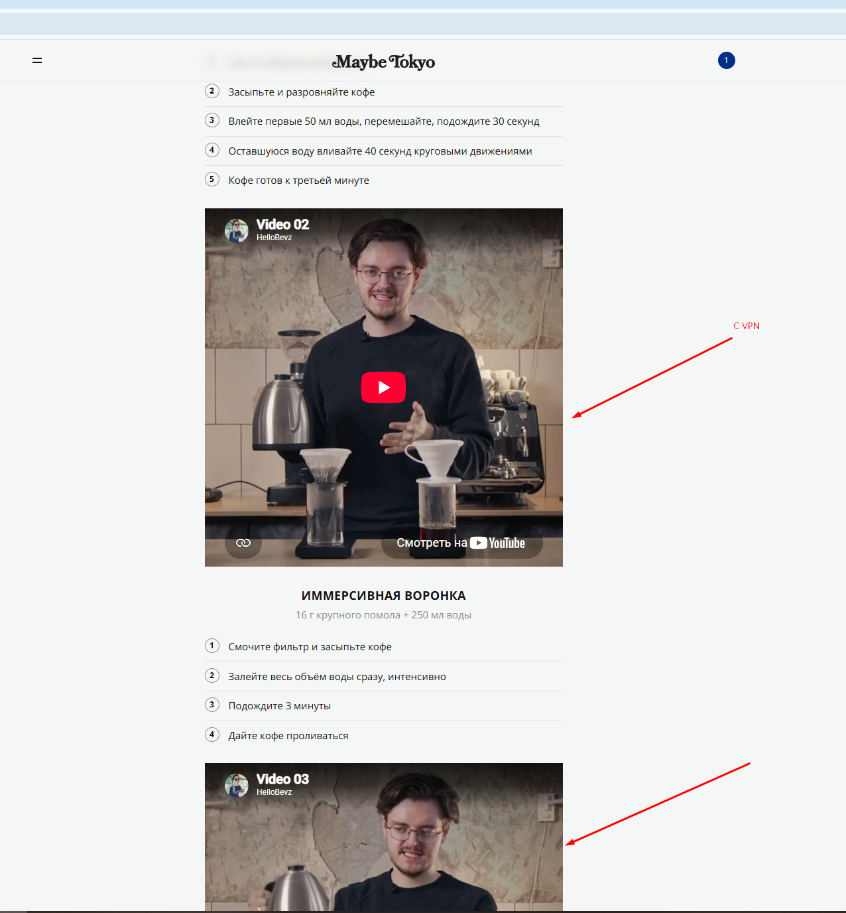

# Bug 018: не отображаются медиа-файлы во вкладке "Как заваривать кофе" без vpn

## Статус
`Open`

## Приоритет
`Major`

## Окружение
- Платформа/ОС: Windows 10
- Браузер (если применимо): Google Chrome

## Описание
Некорректное отображение видео-материалов в разделе "Как заваривать кофе" с выключенных vpn - они отображаются пустыми серыми квадратами.

## Шаги для воспроизведения
1. Выключить vpn.
2. Зайти на сайт.
2. Открыть каталог в верхнем левом углу.
3. Выбрать раздел "Как заваривать кофе" и кликнуть по нему.
4. Пролистнуть страницу ниже.

## Фактический результат
Отображение видео на странице некорректно - в виде серых квадратов.

## Ожидаемый результат
Корректное отображение видео-файлов на странице.

## Скриншоты/логи

